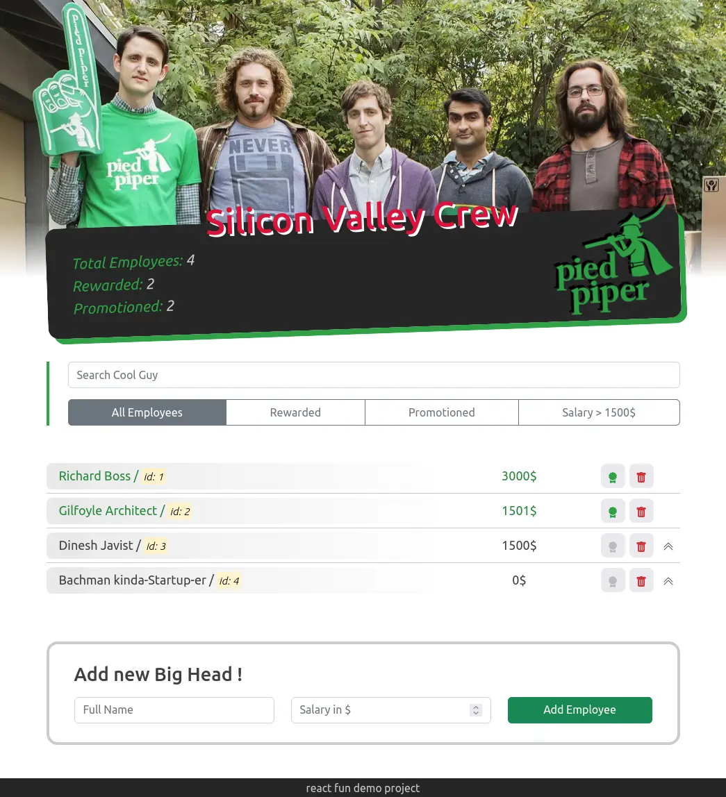

# Pied-Piper-Team-List

> for learning purpose and fun 😃

[Website Link on Netlify](https://filgeary-pied-piper-team-list.netlify.app/)

## Features

- it's kinda simple frontend CRUD app
- Search, Filters, Form
- tests

## Tech stack

- nothing serious )
- React 17 Classes (only for learning, I swear 😄)
- Bootstrap, dah

## Preview

